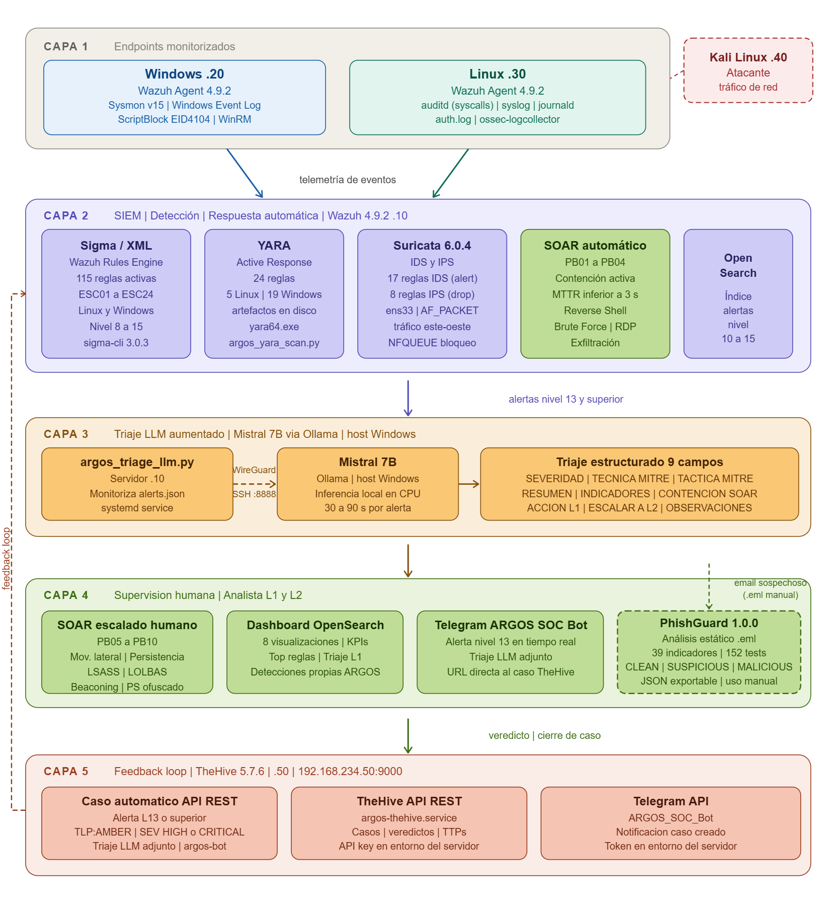
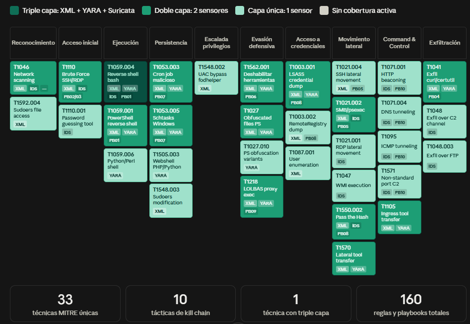

# ARGOS · AI-Augmented SOC Detection & Response Platform

> *XDR open source con IA local, construido desde cero sobre Wazuh. Cada regla nació de un ataque real ejecutado en laboratorio. Cada decisión de la IA fue supervisada, corregida y documentada: **58 correcciones a Claude Sonnet 4.6 · 25 iteraciones de prompt engineering sobre Mistral 7B · +20 escenarios de ataque sin cubrir identificados · TTPs de MITRE alucinados en producción · evidencia forense en riesgo por recomendación del LLM.***

---

## Qué es ARGOS

ARGOS (Augmented Response and Guidance Operations System) es un XDR construido desde cero sobre Wazuh como TFM del Máster en Ciberseguridad (IMMUNE x Universidad Nebrija x Banco Santander) y como diferenciador técnico para roles SOC Analyst / Blue Team.

Cinco capas de detección y respuesta: comportamiento (Sigma/XML), contenido (YARA), red (Suricata IDS/IPS), respuesta automatizada (SOAR Python), triaje con LLM local (Ollama + Mistral 7B) y gestión de incidentes (TheHive 5). Cada regla nació de un ataque real ejecutado en laboratorio. Nada se asumió, todo se validó empíricamente.

La tesis central no es técnica, es operativa: **Claude Sonnet 4.6, la herramienta de IA más avanzada disponible, dejó gaps críticos de cobertura en cada bloque del sistema cuando no había un analista encima corrigiéndola.** 58 correcciones documentadas en el Capítulo 14 de la memoria del proyecto demuestran exactamente dónde falla la IA y por qué el analista L1 no va a desaparecer: va a supervisar a la IA.

---

## Métricas empíricas · Validación 4-5 septiembre 2026

| Métrica | Valor | Contexto |
|---|---|---|
| **MTTD** | 3 a 20 segundos | Frente a 3-20 minutos de respuesta manual L1 |
| **MTTR automático** | < 3 segundos | Escenarios con contención activa PB01-PB04 |
| **Mejora en contención** | **60x a 400x** | MTTR manual 3-20 min → SOAR < 3 s |
| **MTTD ESC05 Reverse Shell** | 8,5 segundos | Detección nula con Wazuh nativo sin ARGOS |
| **MTTD ESC21 LSASS/Mimikatz** | 3 segundos | Detección nula con Wazuh nativo sin ARGOS |
| **MTTD ESC02 Brute Force SSH** | ~7 segundos | Wazuh nativo detectaba a nivel 10 con umbral inferior |
| **MTTD ESC10 Exfiltración curl** | ~5 segundos | Wazuh nativo sin regla de exfiltración por volumen |
| **MTTD ESC07 Movimiento lateral SSH** | ~20 segundos | Wazuh nativo nivel 3 invisible al filtro L1 |
| **Tiempo triaje manual L1** | 3-15 minutos | Identificar evento + mapear MITRE + extraer IOCs + decidir |
| **Tiempo triaje Mistral 7B** | 30-90 segundos | 9 campos estructurados: MITRE, IOCs, kill chain, acción L1 |
| **Mejora en tiempo de triaje** | **2x a 27x** | Adicional a la mejora 60x-400x en contención |
| **Alertas sesión de validación** | 5.286 totales | 473 accionables nivel 12+ en bloque ARGOS (8,9% del total) |
| **Precisión bloque ARGOS** | 76,3% criticidad alta | Vs 67,5% de las reglas nativas Wazuh |
| **Tasa alucinaciones MITRE Mistral 7B** | **24%** | 6 errores en 25 iteraciones + 1 en producción real |
| **Falsos positivos estructurales** | 0 | Durante sesión de validación tras tuning documentado en Cap13 |
| **Coste de licencias** | **0 €** | Stack 100% open source. Equivalente comercial: 50.000-200.000 €/año |
| **Artefactos de detección creados** | **178** | Ninguno de repositorio externo sin revisión |

### Timestamps exactos de los 5 escenarios validados

| Escenario | T0 | T1 (detección) | T2 (contención) | MTTD | MTTR | Playbook |
|---|---|---|---|---|---|---|
| ESC05 Reverse Shell | 18:21:33 | 18:21:41 (UTC+2) | 18:21:42 (UTC+2) | **8,5 s** | **1 s** | PB01 contención |
| ESC02 Brute Force SSH | 18:43:17 | 18:43:24 (UTC+2) | 18:43:27 (UTC+2) | **~7 s** | **~3 s** | PB02 contención |
| ESC10 Exfiltración curl | 18:57:28 | 18:57:33 (UTC+2) | 18:57:33 (UTC+2) | **~5 s** | **<1 s** | PB04 contención parcial |
| ESC07 Movimiento lateral SSH | 21:52:25 | 21:52:45 (UTC+2) | N/A | **~20 s** | escalado | PB05 notif. <1 s |
| ESC21 LSASS/Mimikatz | 21:55:36 | 21:55:39 (UTC+2) | N/A | **~3 s** | escalado | PB08 notif. <1 s |

> Nota metodológica: el servidor .10 corre en UTC; endpoints .30 y .40 en UTC+2 con offset adicional de 2 segundos verificado empíricamente (date simultáneo en ambas máquinas). Imprecisión máxima ±4 segundos, no material para las conclusiones dado el orden de magnitud de la diferencia.

---

## Wazuh nativo vs ARGOS · Comparativa baseline

| Escenario | Wazuh nativo | Nivel | ARGOS MTTD | Nivel ARGOS | Diferencia |
|---|---|---|---|---|---|
| ESC02 Brute Force SSH | Reglas 5712/5763: umbral 8 intentos, ventana silencio 60s | 10 | 7 s | 12 | Umbral 5 sin ventana, escalado PB02 |
| ESC05 Reverse Shell | **Sin detección** (auditd sin syscall connect configurado) | N/D | 8,5 s | 13 | **De invisible a detectado en segundos** |
| ESC07 Movimiento lateral SSH | Regla 5715: auth exitosa, invisible al filtro L1 | 3 | 20 s | 10 | De nivel 3 ignorado a escalado PB05 + MITRE |
| ESC21 LSASS/Mimikatz | **Sin detección** (sin Sysmon ni reglas LSASS) | N/D | 3 s | 15 | **De invisible a detectado en 3 segundos** |

---

## Arquitectura · 5 capas



```
          ┌────────────────────────────────────────┐
          │        ARGOS · Wazuh Server            │
          │        192.168.234.10                  │
          │                                        │
          │  Wazuh 4.9.2 + OpenSearch Dashboards   │
          │  Reglas Sigma propias (24)             │
          │  Reglas XML propias (115)              │
          │  Reglas YARA propias (24)              │
          │  Suricata IDS/IPS (25 reglas)          │
          │  SOAR Playbooks Python (10)            │
          │  argos_triage_llm.py                   │
          │  argos_thehive_integration.py          │
          └──────┬──────────────────┬─────────────┘
                 │                  │
          SSH tunnel           API REST HTTP
          (triaje LLM)         (gestión casos)
                 │                  │
    ┌────────────▼──┐    ┌──────────▼───────────┐
    │  Host Windows │    │    ARGOS-TheHive      │
    │  físico       │    │    192.168.234.50     │
    │               │    │                      │
    │  Ollama        │    │    TheHive 5.7.6     │
    │  Mistral 7B   │    │    Cassandra 4.1      │
    │  127.0.0.1    │    │    Elasticsearch 7.x  │
    └───────────────┘    └──────────────────────┘

          │ Wazuh Agent (telemetría cifrada)
          │
┌─────────┴──────────────────────────────┐
│                                        │
▼                    ▼                   ▼
┌──────────────┐  ┌──────────────┐  ┌───────────┐
│ Linux · .30  │  │ Windows · .20│  │ Kali · .40│
│              │  │              │  │ (atacante)│
│ auditd       │  │ Sysmon v15   │  └───────────┘
│ auth.log     │  │ ScriptBlock  │
│ ufw.log      │  │ Security Log │
│ Wazuh Agent  │  │ Wazuh Agent  │
└──────────────┘  └──────────────┘
```

### Flujo de alerta extremo a extremo

```
Endpoint .20 (Windows) / .30 (Linux)
  genera evento: proceso, red, fichero, autenticacion
       | Wazuh Agent - telemetria cifrada
       v
Wazuh Manager - 192.168.234.10
  decodifica + aplica reglas en cadena:
  |-- Sigma/XML  -> deteccion por comportamiento
  |-- YARA       -> FIM detecta artefacto -> Active Response -> escaneo
  +-- Suricata   -> deteccion de red (IDS alert / IPS drop)
       | alerta nivel X -> /var/ossec/logs/alerts/alerts.json
       |
       |-->> OpenSearch Dashboards  <- analista L1 visualiza en tiempo real
       |
       v (nivel 10+)
argos_triage_llm.py              <- daemon systemd en .10
  peticion via SSH tunnel -> Ollama/Mistral 7B - host Windows fisico
  genera triaje estructurado - 9 campos
       |
       |-->> Telegram SOC Bot       <- notificacion inmediata al analista
       |
       +-->> argos_triage_cache.json <- cache indexado por alert_id
                   |
                   v (nivel 13+)
argos_thehive_integration.py     <- daemon systemd en .10
  crea caso automatico en TheHive - .50:9000
  adjunta triaje LLM como nota estructurada
       |
       v
TheHive 5 - 192.168.234.50
  analista L1 revisa caso + triaje LLM
  registra veredicto (TP / FP / Indeterminate)
  -> base de datos estructurada de decisiones del analista
  -> permite calcular tasa de acuerdo LLM-analista por categoria
       |
       v (si contencion requerida)
SOAR Playbooks PB01-PB10        <- servicios systemd en .10
  PB01-PB04: contencion activa  -> bloqueo ufw/netsh - kill proceso
  PB05-PB10: escalado humano    -> notificacion L2 con contexto completo
       |
       v
Endpoint .20 / .30              <- contencion ejecutada
```

---

## Inventario de detección · 178 artefactos

### Resumen por capa

| Capa | Tecnología | Artefactos | Cobertura |
|---|---|---|---|
| Comportamiento endpoint | Sigma + XML Wazuh | 24 reglas Sigma + 115 reglas XML = **139 artefactos** | ESC01-ESC24 · Linux + Windows · Nivel 8-15 |
| Contenido en disco | YARA + Active Response | **24 reglas YARA** | 5 Linux + 19 Windows · artefactos maliciosos |
| Red | Suricata IDS/IPS | **25 reglas** (17 IDS alert + 8 IPS drop) | 5 capas kill chain · tráfico este-oeste |
| Respuesta automática | SOAR Python | **10 playbooks** (4 contención + 6 escalado) | Kill chain completa · MTTR < 3 s |
| Triaje IA | Ollama + Mistral 7B | 9 campos estructurados | Tiempo real · 100% local |
| Gestión incidentes | TheHive 5.7.6 | Casos automáticos nivel 13+ | Feedback loop analista |

**Total: 178 artefactos de detección y respuesta. Ninguno procedente de repositorio externo sin revisión.**

### Cobertura MITRE ATT&CK · 33 técnicas en 10 tácticas



> [Ver heatmap interactivo](docs/argos_mitre_heatmap.html)

| Estadística | Valor |
|---|---|
| Técnicas MITRE únicas cubiertas | **33** |
| Tácticas de la kill chain | **10** (Reconocimiento → Exfiltración) |
| Técnicas con triple cobertura XML+YARA+Suricata | **1** (T1059.004 Reverse Shell bash) |
| Técnicas con doble cobertura | **13** |
| Técnicas con cobertura única | **19** |

La cobertura sigue la **Pirámide del Dolor de David Bianco**: las reglas detectan comportamientos de proceso invariantes (syscall connect, acceso a LSASS, exfiltración por volumen), no herramientas específicas. Un atacante puede cambiar de herramienta; no puede cambiar el comportamiento que la técnica requiere.

---

## Decisiones de diseño fundamentales

Estas son las decisiones arquitectónicas con mayor peso en ARGOS, cada una respaldada por razonamiento técnico documentado en la memoria del TFM.

### 1. Whitelist SSH en lugar de blacklist de herramientas
La IA propuso detectar brute force SSH por banner de herramienta (Hydra, Medusa). El analista rechazó el enfoque: una blacklist es incompleta por definición. Se capturó el tráfico SSH real de la SOC LAN con tcpdump, se identificó que el único cliente legítimo es OpenSSH, y se construyó una whitelist que alerta sobre cualquier banner no-OpenSSH. Cualquier herramienta futura, incluyendo las que no existen todavía, dispara la alerta.

### 2. OLLAMA_HOST=127.0.0.1 con tunnel SSH ED25519
La IA propuso exponer Ollama en 0.0.0.0:11434 con el firewall de Windows como barrera. El analista rechazó la arquitectura: en un SOC, el firewall de Windows es exactamente el control que ESC19 (T1562.001) desactiva. Si caía, Ollama quedaba accesible en toda la SOC LAN, exponiendo el modelo que procesa alertas reales a inyección de prompts. Solución: OLLAMA_HOST=127.0.0.1 exclusivamente, acceso solo via tunnel SSH ED25519 sin excepciones.

### 3. PB08 sin contención automática por diseño
El playbook de Credential Dumping/LSASS tiene la contención automática desactivada por decisión explícita. La IA recomendó terminar el proceso de dumping. El analista rechazó: matar el proceso de LSASS destruye la evidencia forense crítica antes de que L2 llegue al caso. El valor de PB08 no está en contener, sino en notificar a L2 en menos de 1 segundo con contexto completo para que tome la decisión informada. Esta es la demostración más directa del argumento central: el valor de ARGOS no está solo en automatizar, sino en saber cuándo no automatizar.

### 4. Detección por syscall invariante, no por keyword de comando
La IA propuso detectar reverse shell bash buscando "bash -i" o "/dev/tcp" en el campo de comandos. El analista rechazó: esas strings son trivialmente eludibles con ofuscación mínima. La regla correcta monitoriza la syscall connect(2) del proceso bash sobre un socket hacia la zona de atacantes, comportamiento que ninguna variante de reverse shell puede evitar sin dejar de ser una reverse shell.

### 5. IPS drop solo en vectores de certeza absoluta
Las 8 reglas IPS con drop activo cubren exclusivamente vectores donde el falso positivo es prácticamente imposible en el entorno del laboratorio: banner SSH no-OpenSSH, reverse shell TCP hacia .40, HTTP en la SOC LAN (donde no existe tráfico HTTP legítimo este-oeste), DNS tunneling por longitud, ICMP tunneling por payload, Pass-the-Hash NTLMSSP, FTP saliente y SMB al exterior. El resto opera en modo IDS alert porque un falso positivo con drop activo es más dañino que una alerta sin bloqueo.

### 6. Segmentación de red con dos VMnets distintas
La SOC LAN (VMnet1 host-only) está completamente aislada de internet. Una segunda red NAT (VMnet8) proporciona acceso a internet para actualizaciones sin exponer la red de operaciones. Esta arquitectura replica el modelo de segmentación out-of-band real de un SOC: la red de gestión y la red de operaciones son físicamente distintas.

### 7. Rechazo de Open WebUI para la interfaz del LLM
La IA propuso Open WebUI como interfaz de administración para Ollama. El analista rechazó: Open WebUI introduce una superficie de ataque adicional (servidor web en la red), complejidad operacional sin valor para el caso de uso de triaje automático, y almacenamiento de conversaciones que podría contener contexto de incidentes activos. La solución fue tunnel SSH directo sin capa de presentación intermedia.

### 8. TheHive con usuario Service sin acceso web
El usuario argos-bot@argos.local que crea casos automáticamente tiene perfil Service: puede usar la API REST pero no puede iniciar sesión en la interfaz web. La API key se almacena en /etc/environment del servidor .10, nunca en el código. El adaptador NAT de TheHive se retira tras la instalación inicial.

### 9. Mistral 7B sobre LLaMA 3 8B para triaje
LLaMA 3 8B produce respuestas de mayor calidad narrativa pero con mayor variabilidad en el seguimiento del formato de 9 campos obligatorios, generando con más frecuencia la necesidad de postprocesado adicional. Mistral 7B demostró mayor consistencia en la tarea de clasificación estructurada con formato rígido, que es exactamente el caso de uso del triaje SOC. La latencia (30-90s CPU) es aceptable para triaje de segunda revisión; el SOAR automático opera en paralelo sin esperar el LLM.

---

## Stack

| Capa | Tecnología |
|---|---|
| SIEM / XDR | **Wazuh 4.9.2** + OpenSearch Dashboards |
| Detección por comportamiento | **24 reglas Sigma propias** (.yml) · ESC01-ESC24 · compiladas a OpenSearch via `sigma-cli` 3.0.3 |
| Detección nativa XML | **115 reglas XML Wazuh propias** · 25 Linux + 47 Windows + 25 reglas XML integración YARA (103000-103024) + 21 reglas XML Suricata (110001-110021) |
| Detección por contenido | **24 reglas YARA propias** · 5 Linux + 19 Windows |
| Telemetría Linux | **auditd** (syscalls), auth.log, ufw.log, syslog, journald, ossec-logcollector |
| Telemetría Windows - procesos | **Sysmon v15** (SwiftOnSecurity config) |
| Telemetría Windows - scripts | **ScriptBlock Logging** (Event ID 4104) |
| Telemetría Windows - autenticación | **Security Event Log** (EID 4625, 4624, 4698, 5157...) |
| Detección de red | **Suricata IDS/IPS** · 17 alert + 8 drop · 25 reglas · 5 capas kill chain |
| SOAR | **Python** · 10 playbooks · 13 servicios systemd · contención activa + escalado humano · Telegram |
| Triaje IA | **Ollama** · Mistral 7B · 100% local · SSH tunnel · 25 iteraciones de prompt engineering |
| Gestión de incidentes | **TheHive 5.7.6** · Cassandra 4.1 · Elasticsearch 7.x · VM dedicada .50 · casos automáticos nivel 13+ |
| Taxonomía de referencia | **MITRE ATT&CK v15** · 33 técnicas · 10 tácticas |
| Módulo de phishing | **PhishGuard 1.0.0** · standalone · 39 indicadores · 152 tests · CLEAN/SUSPICIOUS/MALICIOUS |

---

## El problema que resuelve

Los SOC modernos se ahogan en alertas. El modelo clásico de L1 revisando cientos de eventos al día ya no escala. Pero el problema no es solo el volumen: es que la mayoría de entornos Wazuh se despliegan con las reglas por defecto, sin validar si realmente detectan lo que dicen detectar.

ARGOS parte de una premisa diferente: **ninguna regla de detección es válida hasta que un ataque real la dispara en laboratorio.**

El resultado es un XDR donde cada alerta tiene un origen trazable: sabes exactamente por qué dispara, qué ataque la genera, qué dijo la IA sobre esa alerta, y qué decisión tomó el analista cuando la IA no llegaba sola.

---

## Lo que diferencia a ARGOS

- **Detección original, no copiada.** Cada regla nace de un ataque real ejecutado en laboratorio.
- **Ningún campo se asume.** El ataque se simula primero, se analiza la telemetría, y solo entonces se escribe la regla.
- **Human-in-the-loop documentado.** 58 correcciones técnicas a Claude Sonnet 4.6 en el Capítulo 14.
- **Kill chain completa.** 24 escenarios ESC01-ESC24, 25 reglas Suricata, 10 playbooks SOAR.
- **Evidencia de cada paso.** Capturas, telemetría, alerts.log y dashboard por escenario.
- **Detección multicapa.** Comportamiento + contenido + red + triaje IA, capas independientes.
- **IDS + IPS.** 17 alert para visibilidad, 8 drop para bloqueo en vectores de certeza absoluta.
- **Triaje LLM local.** Pipeline completo Wazuh → Ollama/Mistral 7B via SSH tunnel → Telegram. 100% local.
- **Feedback loop.** TheHive registra cada decisión del analista como dato estructurado consultable.
- **Coste cero.** Stack 100% open source. Sin dependencia de infraestructura cloud ni APIs externas.
- **Reproducibilidad total.** Cada regla, script y configuración está versionado en este repositorio.

---

## Hardening aplicado por capa

| Componente | Medidas aplicadas |
|---|---|
| **Ollama / LLM** | `OLLAMA_HOST=127.0.0.1` · acceso exclusivo via tunnel SSH ED25519 · firewall Windows bloqueando puerto 11434 · sin exposición en red |
| **SSH tunnel** | Clave ED25519 · `PermitRootLogin no` · `PasswordAuthentication no` · acceso solo desde .10 |
| **Wazuh + OpenSearch** | TLS entre componentes · credenciales configuradas en despliegue inicial · acceso limitado a SOC LAN |
| **TheHive** | Usuario `argos-bot@argos.local` tipo Service sin acceso web · API key en `/etc/environment` · adaptador NAT retirado tras instalación |
| **Tokens y credenciales** | ARGOS_TOKEN Telegram y THEHIVE_API_KEY en `/etc/environment` · nunca hardcodeados · repositorio publica solo plantillas |
| **Red SOC LAN** | VMnet1 Host-only aislada · sin salida a internet desde VMs de detección · red de gestión separada (VMnet8 NAT) |

---

## Pilar filosófico

**ARGOS rebate la tesis de que el analista L1 va a desaparecer por la IA.**

El Capítulo 14 demuestra empíricamente que si ARGOS se hubiese construido solo con IA habría dejado múltiples gaps críticos. En cada escenario identifiqué correcciones donde el criterio SOC superó a la herramienta: umbrales incorrectos, vectores ignorados, telemetría mal clasificada, exclusiones no contempladas, cobertura YARA insuficiente, arquitectura de red incompleta, playbooks mal diseñados, y alucinaciones técnicas que habrían contaminado el registro permanente de incidentes.

La IA procesa. El analista decide. Y la diferencia entre los dos es exactamente lo que ARGOS documenta.

---

## Evaluación comparativa de modelos de IA

> [Ver comparativa interactiva de 14 modelos](docs/argos_model_comparison.html)

Antes de seleccionar los modelos para ARGOS se evaluaron 14 modelos disponibles en el mercado mediante prompts homogéneos de ciberseguridad: diseño de arquitectura SOC, creación de reglas Sigma/XML/YARA/Suricata, cobertura de vectores MITRE ATT&CK, y razonamiento de analista L1/L2/L3 ante escenarios reales.

**Tres criterios de evaluación:**

| Criterio | Descripción | Referencia externa |
|---|---|---|
| Calidad de razonamiento en ciberseguridad | Arquitectura SOC, lógica de detección, análisis de reglas | CyberCertBench (Ramirez et al., arXiv:2604.20389) sitúa a Claude entre los de mayor rendimiento |
| Gaps críticos dejados sin cubrir | Vectores no identificados, errores MITRE, propuestas arquitectónicas incorrectas | Deng et al. (arXiv:2605.23243): tasas de error 10-50% en modelos de propósito general en ciberseguridad |
| Coste relativo por token/prompt | Tarifas de API normalizadas al volumen del proyecto | Modelos con (*) = ejecución local sin coste de API |

**Resultado:** Claude Sonnet 4.6 ocupa en solitario la zona ideal (máxima calidad, mínimos gaps). Mistral 7B, en ejecución local sin coste, es el único modelo viable para triaje en producción con requisitos de privacidad y coste cero.

---

## Las correcciones que la IA no hizo sola

> [Ver tabla interactiva completa de correcciones](docs/argos_corrections_ia.html)

**58 correcciones a Claude Sonnet 4.6** organizadas en 8 bloques del sistema. **25 iteraciones de prompt engineering sobre Mistral 7B** para el triaje. Naturaleza completamente distinta: las correcciones a Sonnet afectan a la arquitectura de seguridad; las correcciones a Mistral refinan la calidad del output de triaje.

### Distribución de correcciones por bloque

| Bloque | Correcciones | Tipo predominante | Ejemplo representativo |
|---|---|---|---|
| Arquitectura de red | 1 | Arquitectura | Red plana vs. segmentación por zonas |
| 14.1 Endpoint Linux (ESC01-ESC10) | 10 | Cobertura, Campo | Syscall connect vs. keywords de comando (ESC05) |
| 14.2 Endpoint Windows (ESC11-ESC24) | 11 | Umbral, Cobertura | Umbral frequency=10 → 5 sin validación empírica (ESC11) |
| 14.3 Bloque YARA | 12 | Cobertura, Arquitectura | Strings individuales vs. patrón invariante (webshells) |
| 14.4 Bloque Suricata IDS/IPS | 19 | Cobertura, Arquitectura | $EXTERNAL_NET excluye zona de atacantes interna |
| 14.5 Playbooks SOAR | 6 | Arquitectura, Cobertura | No automatizar contención en LSASS (PB08) |
| 14.6 Prompt engineering Mistral 7B | 9 | Guardrail, Campo | Alucinación T1033.001 en producción (ESC21) |
| **TOTAL** | **58** | | |

**El patrón que se repite en cada capa: la IA propone lo que suena razonable. El analista identifica lo que falla en producción.**

### Los fallos que habrían causado daño real

**1. El LLM recomendó terminar mimikatz.exe en un playbook de escalado humano obligatorio.**

PB08 (Credential Dumping / LSASS) es escalado humano obligatorio: cuando mimikatz ha volcado LSASS, el dominio está comprometido y L2 necesita el sistema intacto para análisis forense. El LLM aplicó el patrón de contención automática de PB01-PB04 y recomendó verificar que mimikatz.exe había sido terminado. Si un L1 hubiera ejecutado esa instrucción, habría destruido evidencia forense crítica. La corrección requirió un guardrail explícito: `NUNCA digas que el SOAR actuó en PB08`. El modelo lo repitió tras la primera corrección, requiriendo una segunda iteración con lenguaje más restrictivo.

**2. La IA propuso exponer Ollama en 0.0.0.0:11434 con el firewall de Windows como única barrera.**

En un entorno SOC, el firewall de Windows es exactamente el control que T1562.001 desactiva (ESC19). Si caía, Ollama quedaba accesible en toda la SOC LAN, exponiendo el modelo que procesa alertas reales con contexto de incidentes activos a inyección de prompts. Un informe de Oligo Security (2024) documentó miles de instancias Ollama expuestas sin autenticación siendo usadas para minería de criptomonedas.

**3. La IA detectaba brute force SSH por blacklist de herramientas. El analista invirtió el problema.**

Una blacklist es incompleta por definición. El analista capturó el tráfico SSH real con tcpdump, identificó que el único cliente legítimo es OpenSSH, y construyó una whitelist. Un atacante con una herramienta que no exista todavía dispara la alerta. Con la blacklist, no.

**4. El LLM alucinó un ID MITRE inexistente en producción con una alerta real de LSASS.**

Primera alerta LSASS: T1003.001 correcto. Segunda alerta, mismo ataque, 30 segundos después: T1033.001, que no existe en MITRE ATT&CK. Si hubiera ido a TheHive sin revisión, el caso quedaría indexado con un TTP inexistente. Las correlaciones retrospectivas fallarían. El error es indistinguible de un resultado correcto a simple vista porque T1033.001 tiene el formato correcto y parece plausible en contexto.

**5. Active Response de Wazuh no disparaba para alertas de auditd. El sistema parecía operativo.**

La IA propuso Active Response para PB01 (Reverse Shell Linux). Empiricamente: AR no dispara correctamente para alertas con `log_format:audit` en Wazuh 4.9.2. El fallo no lanza ningún error. El playbook aparecía como activo. En producción, la reverse shell habría generado alerta correctamente y la contención no habría ocurrido. Detección sin respuesta, sin señal de fallo.

**6. La IA protegió Defender y el Firewall. No contempló que el agente Wazuh es un objetivo.**

En ESC19 (T1562.001) la IA propuso cubrir solo la desactivación de Windows Defender (EID 5001) y Firewall (EID 2003). Gap crítico: si el atacante detiene el agente Wazuh, el endpoint queda completamente ciego. No evade una regla, elimina el canal completo por el que llegan todas las reglas.

---

**El analista L1 no va a desaparecer. Va a dejar de mirar logs para convertirse en quien valida, interroga y corrige a la IA. ARGOS documenta exactamente eso, con 58 correcciones y los registros de cada una.**

---

## Triaje LLM · Los 9 campos estructurados

Cada alerta de nivel 10+ recibe un triaje estructurado de Mistral 7B con exactamente estos 9 campos:

| Campo | Contenido | Valor para el analista L1 |
|---|---|---|
| **SEVERIDAD** | CRÍTICA / ALTA / MEDIA / BAJA | Priorización inmediata sin leer el detalle |
| **TÉCNICA MITRE** | ID + nombre (ej: T1059.004 Unix Shell) | Mapeo instantáneo a kill chain sin búsqueda manual |
| **TÁCTICA MITRE** | Táctica de la kill chain | Contexto de fase del ataque |
| **RESUMEN** | Descripción en lenguaje natural del evento | Comprensión en 10 segundos sin parsear logs |
| **INDICADORES** | IOCs extraídos: IPs, procesos, rutas, hashes | Listos para pivotar en el SIEM o bloquear en controles |
| **CONTENCIÓN SOAR** | Playbook recomendado y acción específica | Decisión de respuesta pre-calculada |
| **ACCIÓN L1** | Instrucción específica para el analista | Elimina ambigüedad en la respuesta inmediata |
| **ESCALAR A L2** | Sí/No con justificación | Criterio de escalado explícito |
| **OBSERVACIONES** | Contexto adicional, correlaciones, advertencias | Información que solo el LLM puede sintetizar rápidamente |

> Nota: 150 tokens por triaje típico a 8 tokens/segundo. 19 segundos para prompts cortos, 30-90 segundos para triaje completo con contexto enriquecido según carga del host.

---

## PhishGuard · Módulo de análisis de phishing

[PhishGuard](https://github.com/Miguel-R13/PhishGuard) es una herramienta standalone de análisis estático offline de correos electrónicos `.eml`, desarrollada como complemento a ARGOS para el triaje del vector phishing.

| Característica | Detalle |
|---|---|
| Indicadores | 39 en 4 módulos: cabeceras (SPF/DKIM/DMARC, display name spoofing, cadena Received), URLs (typosquatting, homoglifos, redirectores), adjuntos (magic bytes, entropía, HTML smuggling), IOCs |
| Tests automatizados | **152 tests** · suite ejecutable con un comando · stdlib únicamente |
| Veredictos | CLEAN (0-10) · SUSPICIOUS (11-40) · MALICIOUS (41-100) |
| Exit codes | 0=CLEAN · 1=SUSPICIOUS · 2=MALICIOUS · 3=error · integrables en scripts SOAR |
| Mapeo MITRE | Incluido en el reporte · deduplicado por TTP |
| Dependencias obligatorias | **Cero** · stdlib Python 3.8+ únicamente |
| Output | JSON exportable para adjuntar al ticket o ingestar en el SIEM |

**Casos de validación reales:**

| Caso | Remitente | Veredicto | Score | Indicadores clave |
|---|---|---|---|---|
| Verdadero negativo | ciberwall.notificaciones@policia.es | **CLEAN** | 0/100 | SPF+DKIM+DMARC pass · PDF alta entropía correctamente contextualizada |
| Verdadero positivo medio | miwumi.com | **SUSPICIOUS** | 36/100 | .bin disfrazado de PDF · DMARC bestguesspass |
| Verdadero positivo alto | Netflix falso | **MALICIOUS** | 82/100 | Display name spoofing · DMARC bestguesspass · magic bytes mismatch |

```bash
python3 phishguard.py --full correo.eml --json evidencia.json
```

---

## Limitaciones técnicas documentadas

| Limitación | Impacto | Documentado en |
|---|---|---|
| Kernel 6.8 Ubuntu impide módulo de introspección Wazuh | Sin visibilidad de syscalls de red sin auditd | Cap1, Cap5 |
| 32GB RAM compartidos entre Wazuh + OpenSearch + LLM + endpoints | Sin validación del pipeline end-to-end completo bajo ataque simultáneo | Cap1, Cap12 |
| Suricata 6.0.4 sin correlación de flujos TCP independientes | Detección WMI (ESC11) usa threshold en lugar de patrón real RPC+puerto dinámico | Cap7, Cap13 |
| ESC08 (SCP/SFTP) sin regla XML activa | Ausencia de telemetría viable sin ruido inaceptable en la versión actual | Cap5 |
| Active Response no dispara para alertas `log_format:audit` en Wazuh 4.9.2 | PB01 rediseñado como integration script (no AR nativo) | Cap8, Cap14 |
| Inferencia Mistral 7B CPU 30-90s | Triaje informacional, no operacional en tiempo real | Cap9, Cap12 |
| Sin evaluación sistemática de falsos positivos en producción real | Necesaria antes de cualquier despliegue fuera del laboratorio | Cap1, Cap13 |
| Logs de desarrollo eliminados por espacio en disco | Sin desglose cuantitativo retrospectivo de algunas métricas | Cap12 |

---

## Inventario de detección

### Bloque Linux · Endpoint 192.168.234.30 · Kill chain completa

| # | Escenario | TTP MITRE ATT&CK | Estado |
|---|---|---|---|
| ESC01 | Reconocimiento de red con Nmap | T1046 · Network Service Discovery | ✅ |
| ESC02 | Fuerza bruta SSH | T1110 · Brute Force | ✅ |
| ESC03 | Enumeración de usuarios | T1087.001 · Account Discovery | ✅ |
| ESC04 | Escalada de privilegios con sudo | T1548.003 · Sudo and Sudo Caching | ✅ |
| ESC05 | Reverse shell bash | T1059.004 · Unix Shell | ✅ |
| ESC06 | Cron job malicioso | T1053.003 · Scheduled Task: Cron | ✅ |
| ESC07 | Movimiento lateral SSH | T1021.004 · Remote Services: SSH | ✅ |
| ESC08 | Transferencia lateral SCP/SFTP | T1570 · Lateral Tool Transfer | ✅ |
| ESC09 | Desactivación de herramientas de seguridad | T1562.001 · Impair Defenses | ✅ |
| ESC10 | Exfiltración de datos via curl/wget | T1041 + T1105 | ✅ |

### Bloque Windows · Endpoint 192.168.234.20 · Kill chain completa

| # | Escenario | TTP MITRE ATT&CK | Estado |
|---|---|---|---|
| ESC11 | Reconocimiento de red con Nmap | T1046 · Network Service Discovery | ✅ |
| ESC12 | Fuerza bruta RDP | T1110 · Brute Force | ✅ |
| ESC13 | Enumeración de usuarios Windows | T1087.001 · Account Discovery | ✅ |
| ESC14 | Escalada de privilegios UAC bypass fodhelper | T1548.002 · Bypass UAC | ✅ |
| ESC15 | Reverse shell PowerShell | T1059.001 · PowerShell | ✅ |
| ESC16 | Persistencia via tareas programadas | T1053.005 · Scheduled Task | ✅ |
| ESC17 | Movimiento lateral SMB/psexec | T1021.002 · SMB/Windows Admin Shares | ✅ |
| ESC18 | Transferencia lateral via SMB | T1570 · Lateral Tool Transfer | ✅ |
| ESC19 | Desactivación Defender/Wazuh/Sysmon | T1562.001 · Impair Defenses | ✅ |
| ESC20 | Exfiltración via certutil/PowerShell LOLBAS | T1041 + T1105 | ✅ |
| ESC21 | Credential dumping LSASS/SAM | T1003.001 + T1003.002 | ✅ |
| ESC22 | Pass the Hash | T1550.002 · Pass the Hash | ✅ |
| ESC23 | LOLBAS: regsvr32, mshta, certutil, bitsadmin, wmic | T1218 · System Binary Proxy Execution | ✅ |
| ESC24 | PowerShell ofuscado EncodedCommand | T1027 · Obfuscated Files or Information | ✅ |

### Bloque YARA · Linux + Windows

| # | Regla YARA | Escenario | Fase Kill Chain | MITRE | Estado |
|---|---|---|---|---|---|
| YARA-01 | Bash reverse shell script en disco | ESC05 | Execution | T1059.004 | ✅ |
| YARA-02 | Bash reverse shell en crontab | ESC06 | Persistence | T1053.003 | ✅ |
| YARA-03 | Ingress tool transfer ELF + C2 frameworks | ESC10 | C2 | T1105 | ✅ |
| YARA-04 | Reverse shell Python y Perl | ESC10 | Execution | T1059.006 | ✅ |
| YARA-05 | Webshell PHP y Python | ESC10/ESC08 | Persistence | T1505.003 | ✅ |
| YARA-06 | PowerShell reverse shell TCPClient | ESC15 | Execution | T1059.001 | ✅ |
| YARA-07 | Script PowerShell schtasks persistencia | ESC16 | Persistence | T1053.005 | ✅ |
| YARA-08 | Herramienta ofensiva depositada via SMB | ESC17/ESC18 | Lateral Movement | T1570 | ✅ |
| YARA-09 | Script desactivación herramientas seguridad | ESC19 | Defense Evasion | T1562.001 | ✅ |
| YARA-10 | Archivo Base64 generado por certutil -encode | ESC20 | Exfiltration | T1041 | ✅ |
| YARA-11 | Script PowerShell FromBase64String decoder | ESC20 | Defense Evasion | T1027 | ✅ |
| YARA-12 | Script batch certutil -decode | ESC20 | Defense Evasion | T1027 | ✅ |
| YARA-13 | Comandos mimikatz en scripts | ESC21/ESC22 | Credential Access | T1003.001 | ✅ |
| YARA-14 | Archivo log generado por mimikatz | ESC21/ESC22 | Credential Access | T1003.001 | ✅ |
| YARA-15 | LSASS minidump | ESC21/ESC22 | Credential Access | T1003.001 | ✅ |
| YARA-16 | LOLBAS certutil con URL | ESC23 | C2/Defense Evasion | T1105/T1218 | ✅ |
| YARA-17 | LOLBAS mshta/wscript/cscript con URL | ESC23 | Defense Evasion | T1218 | ✅ |
| YARA-18 | LOLBAS regsvr32/rundll32 con URL | ESC23 | Defense Evasion | T1218 | ✅ |
| YARA-19 | LOLBAS bitsadmin/msiexec/wmic con URL | ESC23 | Defense Evasion | T1218 | ✅ |
| YARA-20 | PowerShell EncodedCommand ofuscado | ESC24 | Defense Evasion | T1027.010 | ✅ |
| YARA-21 | PowerShell SecureString obfuscation | ESC24 | Defense Evasion | T1027.010 | ✅ |
| YARA-22 | PowerShell GZip/Deflate compression | ESC24 | Defense Evasion | T1027.010 | ✅ |
| YARA-23 | PowerShell AMSI bypass | ESC24 | Defense Evasion | T1562.001 | ✅ |
| YARA-24 | PowerShell string manipulation obfuscation | ESC24 | Defense Evasion | T1027.010 | ✅ |

### Bloque Suricata · Red 192.168.234.0/24 · 5 capas kill chain

| # | Escenario | Capa | TTP MITRE ATT&CK | Modo | Estado |
|---|---|---|---|---|---|
| SURICATA-ESC01 | TCP SYN Port Scan nmap invariant win:1024 | Reconocimiento | T1046 | alert | ✅ |
| SURICATA-ESC01b | Generic Scanner Threshold | Reconocimiento | T1046 | alert | ✅ |
| SURICATA-ESC02 | SSH Brute Force banner no estándar | Acceso inicial | T1110.001 | alert+drop | ✅ |
| SURICATA-ESC03 | Reverse Shell TCP hacia zona atacantes interna | C2 | T1059.004 | alert+drop | ✅ |
| SURICATA-ESC03b | Reverse Shell TCP hacia IP externa | C2 | T1059.004 | alert | ✅ |
| SURICATA-ESC04 | HTTP Beaconing en SOC LAN | C2 | T1071.001 | alert+drop | ✅ |
| SURICATA-ESC05 | DNS Tunneling subdominio largo | C2 | T1071.004 | alert+drop | ✅ |
| SURICATA-ESC06 | ICMP Tunneling payload anómalo | C2 | T1095 | alert+drop | ✅ |
| SURICATA-ESC07 | Long Connection TCP beaconing persistente | C2 | T1571 | alert | ✅ |
| SURICATA-ESC08 | SSH hacia múltiples destinos internos | Movimiento lateral | T1021.004 | alert | ✅ |
| SURICATA-ESC09 | RDP hacia múltiples destinos internos | Movimiento lateral | T1021.001 | alert | ✅ |
| SURICATA-ESC09b | RDP Brute Force mismo destino | Movimiento lateral | T1110.001 | alert | ✅ |
| SURICATA-ESC10 | SMB anómalo entre endpoints | Movimiento lateral | T1021.002 | alert | ✅ |
| SURICATA-ESC11 | WMI RPC puerto 135 | Movimiento lateral | T1047 | alert | ✅ |
| SURICATA-ESC12 | Pass-the-Hash NTLMSSP SMB | Movimiento lateral | T1550.002 | alert+drop | ✅ |
| SURICATA-ESC13 | Port scan interno desde endpoint comprometido | Movimiento lateral | T1046 | alert | ✅ |
| SURICATA-ESC14 | Exfiltración por volumen de datos TCP | Exfiltración | T1048 | alert | ✅ |
| SURICATA-ESC15 | FTP saliente, protocolo inseguro | Exfiltración | T1048.003 | alert+drop | ✅ |
| SURICATA-ESC16 | SMB hacia exterior | Exfiltración | T1048 | alert+drop | ✅ |

### Bloque SOAR · Playbooks Python · Kill chain completa

| # | Escenario | Sensores | Tipo | MTTR | Estado |
|---|---|---|---|---|---|
| PB01 | Reverse Shell / C2 | ESC05/ESC15 + YARA-01/06 + SURICATA-ESC03 | Contención activa (ufw/netsh + kill) | < 1 s | ✅ |
| PB02 | Brute Force SSH | ESC02 + SURICATA-ESC02 | Contención activa (ufw) | ~3 s | ✅ |
| PB03 | Brute Force RDP | ESC12 + SURICATA-ESC09b | Contención activa (netsh) | < 3 s | ✅ |
| PB04 | Exfiltración de datos | ESC10/ESC20 + SURICATA-ESC14/15 | Contención activa (kill + ufw/netsh) | < 1 s | ✅ |
| PB05 | Movimiento lateral | ESC07/08/17/18 + SURICATA-ESC08/09/10/11 | Escalado humano | < 1 s notif. | ✅ |
| PB06 | Desactivación herramientas seguridad | ESC09/19 + YARA-09 | Escalado humano | < 1 s notif. | ✅ |
| PB07 | Persistencia | ESC06/16 + YARA-02/07 | Escalado humano | < 1 s notif. | ✅ |
| PB08 | Credential Dumping / LSASS | ESC21/22 + YARA-13/14/15 | **Escalado humano OBLIGATORIO** · contención automática desactivada por diseño · matar LSASS destruye evidencia forense | < 1 s notif. | ✅ |
| PB09 | LOLBAS / Defense Evasion | ESC23/24 + YARA-16 al 24 | Escalado humano | < 1 s notif. | ✅ |
| PB10 | Beaconing / C2 red | SURICATA-ESC04/05/06/07 | Escalado humano | < 1 s notif. | ✅ |

### Triaje LLM · Pipeline Ollama local

| Componente | Detalle | Estado |
|---|---|---|
| Modelo | Mistral 7B (inferencia CPU, 100% local, elegido sobre LLaMA 3 8B por mayor consistencia en formato estructurado) | ✅ |
| Canal | SSH tunnel ED25519 · .10:8888 → Windows:11434 | ✅ |
| Seguridad | OLLAMA_HOST=127.0.0.1, firewall Windows bloqueando puerto 11434, OpenSSH hardened | ✅ |
| Script | `llm/argos_triage_llm.py` · daemon tiempo real sobre alerts.json | ✅ |
| Caché | `argos_triage_cache.json` · indexado por alert_id · puente con TheHive | ✅ |
| Notificación | Telegram bot ARGOS_SOC_Bot | ✅ |
| Validación | 25 iteraciones en 5 escenarios · validación empírica con ataques reales | ✅ |
| Tasa alucinaciones MITRE | **24%** (6/25 iteraciones + 1 en producción real) · justifica human-in-the-loop obligatorio | ✅ |
| Output | 9 campos: SEVERIDAD · TECNICA MITRE · TACTICA MITRE · RESUMEN · INDICADORES · CONTENCION SOAR · ACCION L1 · ESCALAR A L2 · OBSERVACIONES | ✅ |
| Rendimiento | ~150 tokens/triaje · 8 tokens/s · 19s prompts cortos · 30-90s triaje completo bajo carga | ✅ |

### Integración TheHive · Gestión de incidentes y feedback loop

| Componente | Detalle | Estado |
|---|---|---|
| Instancia | TheHive 5.7.6 · all-in-one single node · VM dedicada | ✅ |
| Backend | Cassandra 4.1 + Elasticsearch 7.x | ✅ |
| Acceso | http://192.168.234.50:9000 · SOC LAN VMnet1 | ✅ |
| Script | `thehive/argos_thehive_integration.py` · monitoriza alerts.json | ✅ |
| Umbral | Casos automáticos para alertas nivel 13+ · manuales para nivel 10-12 | ✅ |
| Triaje adjunto | 9 campos Mistral 7B como nota estructurada en cada caso | ✅ |
| Veredictos | True Positive / False Positive / Indeterminate · registra decisión del analista | ✅ |
| Feedback loop | Cada caso cerrado = dato estructurado para calcular tasa de acuerdo LLM-analista | ✅ |
| Usuario servicio | argos-bot@argos.local · tipo Service · sin acceso web · API key en /etc/environment | ✅ |
| Servicios systemd | `argos-triage-llm` + `argos-thehive` · activos en .10 | ✅ |

---

## Estado y roadmap

| Componente | Estado |
|---|---|
| Wazuh 4.9.2 + OpenSearch + agentes | ✅ Implementado |
| Sysmon v15 (SwiftOnSecurity) en endpoint Windows | ✅ Implementado |
| ScriptBlock Logging en endpoint Windows | ✅ Implementado |
| Reglas Sigma propias · 24 reglas (10 Linux + 14 Windows) | ✅ Completado |
| Reglas XML Wazuh propias · bloque Linux ESC01-ESC10 | ✅ Completado |
| Reglas XML Wazuh propias · bloque Windows ESC11-ESC24 | ✅ Completado |
| Pipeline YARA · FIM + Active Response + decoder + reglas XML | ✅ Implementado |
| Reglas YARA · 24 reglas completas (YARA-01 a YARA-24) | ✅ Completado |
| Suricata IDS/IPS · 25 reglas · 5 capas kill chain · 8 drops | ✅ Completado |
| Playbooks SOAR en Python · 10 playbooks PB01-PB10 | ✅ Completado |
| Notificaciones Telegram · canal ARGOS SOC Alerts | ✅ Completado |
| Triaje LLM local (Ollama + Mistral 7B) | ✅ Completado |
| Integración TheHive 5 · gestión de incidentes | ✅ Completado |
| Dashboard de supervisión humana · 8 visualizaciones OpenSearch | ✅ Completado |
| Evaluación cuantitativa (MTTD · MTTR · precisión LLM) | ✅ Completado |
| PhishGuard 1.0.0 · análisis estático de phishing standalone | ✅ Completado |
| Script tasa de acuerdo LLM-analista via TheHive API | 📅 Q4 2026 (infraestructura lista, limitación RAM impide simultaneidad Wazuh+TheHive) |
| Migración a Suricata 7.x (correlación flujos TCP, app-layer-protocol) | 📅 Q4 2026 |
| Release público completo con documentación de despliegue | 📅 Q4 2026 |

---

## Infraestructura del laboratorio

| VM | IP | SO | RAM | Rol |
|---|---|---|---|---|
| ARGOS-Wazuh | 192.168.234.10 | Ubuntu 22.04 | 8 GB | Wazuh 4.9.2 + OpenSearch + SOAR + LLM daemons |
| ARGOS-Windows | 192.168.234.20 | Windows 10 Pro | 4 GB | Endpoint Windows + Ollama/Mistral 7B |
| ARGOS-Linux | 192.168.234.30 | Ubuntu 22.04 | 2 GB | Endpoint Linux |
| ARGOS-Kali | 192.168.234.40 | Kali Linux | 1 GB | Atacante |
| ARGOS-TheHive | 192.168.234.50 | Ubuntu 22.04 | 8 GB | TheHive 5.7.6 + Cassandra 4.1 + Elasticsearch 7.x |

Red SOC LAN: 192.168.234.0/24 VMnet1 Host-only aislada. Red de gestión: 192.168.91.0/24 VMnet8 NAT (actualizaciones, sin acceso desde VMs de detección a producción). Host: laptop i7 32 GB, VMware Workstation 17.6.4.

---

## Estructura del repositorio

```
ARGOS/
├── detection/
│   ├── sigma/                  # Reglas Sigma propias (.yml) · Linux + Windows
│   ├── wazuh/                  # Reglas XML Wazuh propias · Linux + Windows
│   │   ├── active-response/    # Scripts Active Response YARA
│   │   │   ├── argos_yara_scan.py
│   │   │   └── argos_yara_scan_win.py
│   │   ├── argos_yara_decoder.xml
│   │   ├── argos_yara_rules.xml        # Reglas 103000-103024
│   │   └── argos_suricata_rules.xml    # Reglas 110001-110021
│   ├── suricata/               # Reglas Suricata propias · 25 reglas · 5 capas
│   │   └── argos.rules         # 17 alert + 8 drop · IDS/IPS
│   └── yara/
│       ├── linux/              # 5 reglas YARA bloque Linux (YARA-01 a YARA-05)
│       └── windows/            # 19 reglas YARA bloque Windows (YARA-06 a YARA-24)
├── soar/
│   └── playbooks/              # 10 playbooks SOAR Python + servicios systemd
├── llm/
│   ├── argos_triage_llm.py
│   ├── argos_chat.py
│   ├── argos_test_llm.py
│   └── argos-ollama-tunnel.service
├── thehive/
│   ├── argos_thehive_integration.py
│   ├── argos-thehive.service
│   └── argos-triage-llm.service
├── dashboard/
├── docs/
│   ├── architecture/
│   │   ├── argos_arquitectura_5_capas.png
│   │   └── argos_mitre_cobertura.png
│   ├── argos_corrections_ia.html
│   ├── argos_mitre_heatmap.html
│   └── argos_model_comparison.html
└── README.md
```

---

## Requisitos

- Wazuh Server 4.9.2 + agente Linux o Windows
- OpenSearch + OpenSearch Dashboards
- Sysmon v15+ con configuración SwiftOnSecurity (endpoints Windows)
- Python 3.11+
- sigma-cli 3.0.3
- YARA 4.5.5
- Suricata 6.0.4+
- pywinrm (para playbooks Windows)
- Ollama con Mistral 7B (host con acceso SSH desde el servidor Wazuh)
- TheHive 5.7.6 + Cassandra 4.1 + Elasticsearch 7.x (VM dedicada recomendada, 8 GB RAM)

---

## Autor

**Miguel Reguero** · Blue Team / SOC Analyst  
[LinkedIn](https://www.linkedin.com/in/miguel-reguero/) · [GitHub](https://github.com/Miguel-R13) · [Portfolio](https://miguel-r13.github.io)

Máster en Ciberseguridad · IMMUNE x Universidad Nebrija x Banco Santander  
Top 5% TryHackMe · Autor de [PhishGuard](https://github.com/Miguel-R13/PhishGuard)
